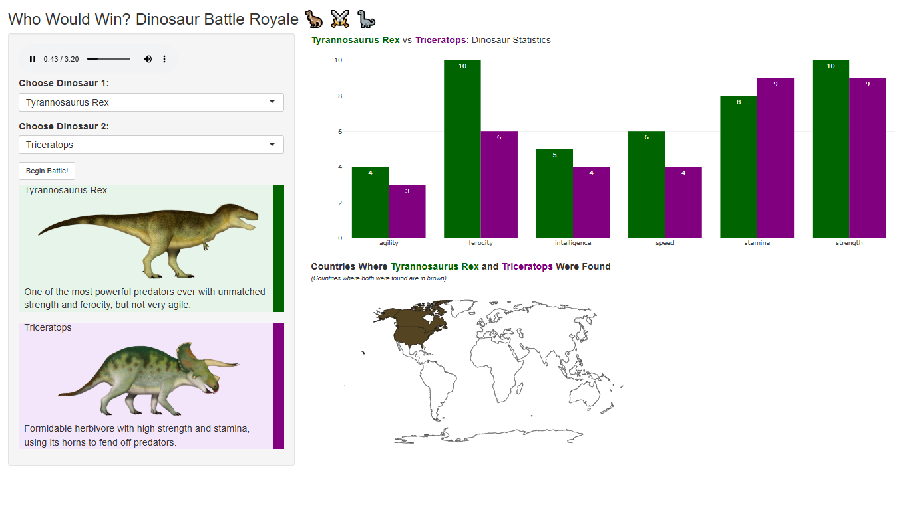

When R Shiny meets my young dinosaur-enthused stakeholder, we get this interactive dino-adventure and feature requests become roars and user acceptance testing involves stomping feet.

[Try the App Now](https://analytically-ray.shinyapps.io/dinosaur_battle_app/)

# 🦖 Dinosaur Battle App

An interactive R Shiny app where dinosaurs battle in a turn-based game with battle narration! Built for fun, learning, and engagement—especially great for kids!

## 🚀 Features

- **Battle Commentary**: Narrates dinosaur battle rounds with attacks, counters and damage to health points.
- **Dynamic Visuals**: Each dinosaur has unique stats and facts, with responsive images and visual health overlays.
- **Geographic Map**: Displays countries where each dinosaur was discovered, with overlap regions highlighted in brown.
- **Customizable Matchups**: Choose any two dinosaurs from the database to simulate a battle.
- **Responsive Design**: App adjusts image size and layout to fit various screen widths, ensuring accessibility across devices.

## 🧠 Dino Database

Each dinosaur includes:
- Fun facts
- 6 stats: Strength, Speed, Ferocity, Intelligence, Agility, Stamina
- Countries of discovery
- A publicly hosted image (wikimedia)

## 📦 Dependencies

         

[RStudio Hex Stickers](https://github.com/rstudio/hex-stickers)